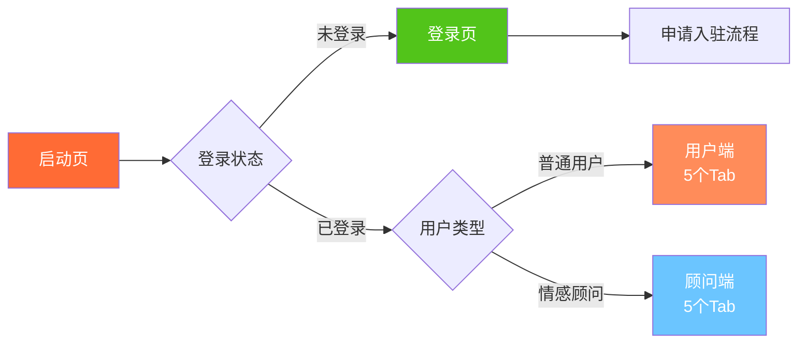
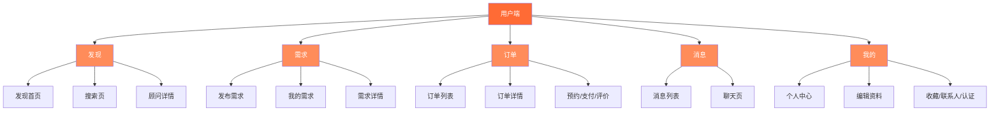
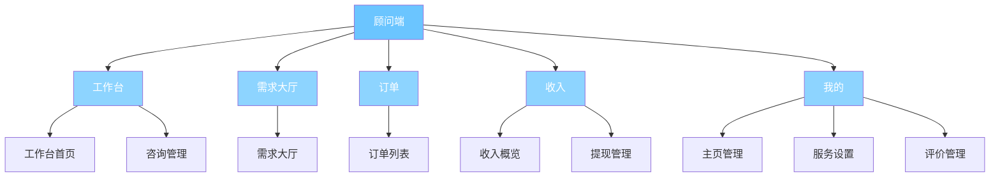
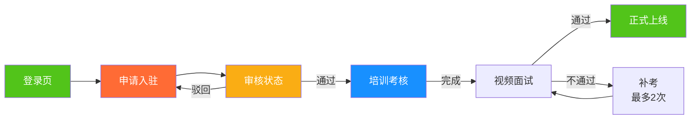

# UYOU 无忧陪伴 - UI设计规范

> 微信小程序UI设计规范文档 | 包含设计系统、组件库、页面布局说明

> 版本：v1.0 | 更新日期：2026-01-15 | 设计状态：设计阶段

---

## 一、信息架构

### 1.1 整体架构图

#### 1.1.1 系统总览



#### 1.1.2 用户端架构



#### 1.1.3 顾问端架构



#### 1.1.4 入驻流程



### 1.2 用户端页面层级

```
用户端（5个Tab）
├── 发现 Tab
│   ├── 发现首页（/pages/discovery/index）
│   ├── 搜索页（/pages/discovery/search）
│   └── 顾问详情（/pages/consultant/detail）
├── 需求 Tab
│   ├── 发布需求（/pages/demand/create）
│   ├── 我的需求（/pages/demand/list）
│   └── 需求详情（/pages/demand/detail）
├── 订单 Tab
│   ├── 订单列表（/pages/order/list）
│   ├── 订单详情（/pages/order/detail）
│   ├── 预约顾问（/pages/order/create）
│   ├── 订单确认（/pages/order/confirm）
│   ├── 评价页（/pages/order/review）
│   └── 支付页（/pages/payment/index）
├── 消息 Tab
│   ├── 消息列表（/pages/message/list）
│   └── 聊天页（/pages/message/chat）
└── 我的 Tab
    ├── 个人中心（/pages/profile/index）
    ├── 编辑资料（/pages/profile/edit）
    ├── 实名认证（/pages/profile/verification）
    ├── 紧急联系人（/pages/profile/emergency）
    ├── 我的收藏（/pages/profile/favorites）
    ├── 紧急求助（/pages/security/help）
    └── 投诉举报（/pages/security/report）
```

### 1.3 顾问端页面层级

```
顾问端（5个Tab）
├── 工作台 Tab
│   ├── 工作台（/pages/partner/workbench）
│   └── 咨询管理（/pages/partner/consult）
├── 需求大厅 Tab
│   └── 需求大厅（/pages/partner/hall）
├── 订单 Tab
│   └── 订单列表（/pages/partner/orders）
├── 收入 Tab
│   ├── 收入概览（/pages/partner/income）
│   └── 提现管理（/pages/partner/withdraw）
└── 我的 Tab
    ├── 主页管理（/pages/partner/profile）
    ├── 服务设置（/pages/partner/service）
    └── 评价管理（/pages/partner/reviews）

入驻流程（独立流程）
├── 申请入驻（/pages/partner/apply）
├── 审核状态（/pages/partner/status）
└── 培训考核（/pages/partner/training）
```

---

## 二、设计原则

### 2.1 设计理念

- **温暖陪伴**：使用柔和的暖色调，营造温暖、信任的氛围
- **简洁高效**：信息层级清晰，操作路径简洁，减少用户思考成本
- **安全可靠**：突出认证标识、安全提示，增强用户信任感
- **个性化**：展示真实照片、视频，增强真实感和个性化

### 2.2 微信小程序规范遵循

- **导航栏**：遵循微信官方规范，高度44px（iOS）/48px（Android）
- **底部Tab**：最多5个，图标+文字，选中状态明确
- **页面层级**：不超过5层，避免过深导航
- **字体大小**：最小12px，正文14-16px，标题18-24px
- **点击区域**：最小44×44px，符合手指操作习惯
- **适配规范**：考虑iOS和Android的差异，适配不同屏幕尺寸

---

## 三、视觉规范

### 3.1 颜色系统

#### 主色调（温暖、信任）

| 颜色名称 | 色值 | 使用场景 |
|---------|------|---------|
| **主色-暖橙** | `#FF6B35` | 主要按钮、强调色、品牌色 |
| **主色-浅橙** | `#FF8C5A` | 按钮悬停、次要强调 |
| **主色-深橙** | `#E55A2B` | 按钮按下、深色强调 |

#### 辅助色（情感、陪伴）

| 颜色名称 | 色值 | 使用场景 |
|---------|------|---------|
| **辅助色-粉** | `#FFB3D9` | 女性顾问标识、温馨提示 |
| **辅助色-蓝** | `#6BC5FF` | 男性顾问标识、信息提示 |
| **辅助色-紫** | `#B388FF` | 特殊功能、VIP标识 |

#### 中性色（文字、背景）

| 颜色名称 | 色值 | 使用场景 |
|---------|------|---------|
| **文字-主** | `#333333` | 标题、重要文字 |
| **文字-次** | `#666666` | 正文、次要文字 |
| **文字-辅助** | `#999999` | 提示文字、占位符 |
| **文字-禁用** | `#CCCCCC` | 禁用状态文字 |
| **背景-主** | `#FFFFFF` | 页面背景、卡片背景 |
| **背景-次** | `#F5F5F5` | 列表背景、分割区域 |
| **背景-深** | `#F0F0F0` | 输入框背景、禁用背景 |
| **分割线** | `#E5E5E5` | 列表分割线、边框 |

#### 功能色（状态反馈）

| 颜色名称 | 色值 | 使用场景 |
|---------|------|---------|
| **成功-绿** | `#52C41A` | 成功提示、完成状态 |
| **警告-橙** | `#FAAD14` | 警告提示、待处理状态 |
| **错误-红** | `#FF4D4F` | 错误提示、危险操作 |
| **信息-蓝** | `#1890FF` | 信息提示、链接 |

### 3.2 字体规范

#### 字号系统（基于微信小程序规范）

| 字号 | 大小 | 使用场景 |
|------|------|---------|
| **超大标题** | 32px | 启动页标题、大屏展示 |
| **大标题** | 24px | 页面主标题 |
| **中标题** | 20px | 卡片标题、模块标题 |
| **小标题** | 18px | 列表项标题 |
| **正文-大** | 16px | 正文内容、按钮文字 |
| **正文-中** | 14px | 正文内容（默认） |
| **正文-小** | 12px | 辅助文字、标签文字 |
| **极小** | 10px | 版权信息、极小提示 |

#### 字重

| 字重 | 值 | 使用场景 |
|------|-----|---------|
| **细体** | 300 | 辅助文字 |
| **常规** | 400 | 正文内容（默认） |
| **中等** | 500 | 小标题、强调文字 |
| **粗体** | 600 | 标题、重要强调 |
| **特粗** | 700 | 大标题、品牌标识 |

#### 行高

| 字号 | 行高 | 比例 |
|------|------|------|
| 32px | 44px | 1.375 |
| 24px | 34px | 1.417 |
| 20px | 28px | 1.4 |
| 18px | 26px | 1.444 |
| 16px | 24px | 1.5 |
| 14px | 20px | 1.429 |
| 12px | 18px | 1.5 |

### 3.3 间距系统

基于4px基础单位，形成8/12/16/24/32px间距体系：

| 间距值 | 使用场景 |
|--------|---------|
| **4px** | 极小间距（图标与文字） |
| **8px** | 小间距（列表项内元素） |
| **12px** | 中小间距（卡片内元素） |
| **16px** | 中等间距（卡片内分组） |
| **24px** | 大间距（卡片之间、模块之间） |
| **32px** | 超大间距（页面边距、大模块之间） |
| **48px** | 特大间距（页面上下边距） |

### 3.4 圆角规范

| 圆角值 | 使用场景 |
|--------|---------|
| **4px** | 小按钮、标签、输入框 |
| **8px** | 卡片、中等按钮 |
| **12px** | 大卡片、图片容器 |
| **16px** | 特殊卡片、弹窗 |
| **50%** | 圆形（头像、图标按钮） |

### 3.5 阴影规范

| 阴影层级 | 阴影值 | 使用场景 |
|---------|--------|---------|
| **无阴影** | `none` | 背景、分割线 |
| **轻微阴影** | `0 2px 8px rgba(0,0,0,0.04)` | 卡片、输入框 |
| **中等阴影** | `0 4px 12px rgba(0,0,0,0.08)` | 悬浮卡片、弹窗 |
| **重阴影** | `0 8px 24px rgba(0,0,0,0.12)` | 模态弹窗、重要提示 |

---

## 四、组件库

### 4.1 基础组件

#### 按钮（Button）

**主要按钮**
- 尺寸：高度44px，圆角8px
- 颜色：主色-暖橙（#FF6B35），文字白色
- 状态：默认、按下（#E55A2B）、禁用（#CCCCCC）
- 使用场景：主要操作（立即预约、确认支付）

**次要按钮**
- 尺寸：高度44px，圆角8px
- 颜色：背景白色，边框主色，文字主色
- 状态：默认、按下（背景浅橙）、禁用
- 使用场景：次要操作（取消、返回）

**文字按钮**
- 尺寸：高度44px（最小点击区域）
- 颜色：文字主色，无背景
- 使用场景：链接式操作（查看详情、更多）

**危险按钮**
- 尺寸：同主要按钮
- 颜色：错误-红（#FF4D4F）
- 使用场景：危险操作（取消订单、删除）

#### 输入框（Input）

- 高度：44px
- 圆角：4px
- 边框：1px，颜色#E5E5E5
- 内边距：12px 16px
- 字体：14px，颜色#333333
- 占位符：14px，颜色#999999
- 状态：默认、聚焦（边框主色）、错误（边框红色）、禁用（背景#F0F0F0）

#### 标签（Tag）

- 尺寸：高度24px，内边距4px 8px
- 圆角：4px
- 字体：12px
- 类型：
  - 默认：背景#F5F5F5，文字#666666
  - 主色：背景浅橙，文字主色
  - 成功：背景浅绿，文字成功色
  - 警告：背景浅橙，文字警告色

#### 头像（Avatar）

- 尺寸：小（40px）、中（60px）、大（80px）、超大（120px）
- 形状：圆形（50%圆角）
- 占位图：默认头像图标
- 边框：2px白色（用于卡片展示）

#### 评分（Rating）

- 尺寸：图标20px
- 颜色：选中（#FFD700金色）、未选中（#E5E5E5灰色）
- 间距：图标间距4px
- 显示：支持显示数字评分（如4.8）

### 4.2 业务组件

#### 顾问卡片（ConsultantCard）

**布局结构：**
```
[头像] [昵称] [认证标识]
      [评分] [订单数] [距离]
      [服务标签]
      [价格] [立即预约按钮]
```

**尺寸：**
- 卡片高度：约160px
- 头像：60px圆形
- 内边距：16px
- 圆角：12px
- 阴影：轻微阴影

**关键信息：**
- 头像、昵称、认证标识（顶部）
- 评分（星级+数字）、订单数、距离（中部）
- 服务标签（最多3个）
- 价格、立即预约按钮（底部）

#### 订单卡片（OrderCard）

**布局结构：**
```
[订单号] [状态标签]
[顾问头像+昵称]
[服务信息：类目、时间、地点]
[订单金额] [操作按钮]
```

**尺寸：**
- 卡片高度：约140px
- 内边距：16px
- 圆角：8px

**状态颜色：**
- 待接单：警告-橙
- 待支付：主色-暖橙
- 已支付：信息-蓝
- 进行中：信息-蓝
- 已完成：成功-绿
- 已取消：文字-辅助

#### 需求卡片（DemandCard）

**布局结构：**
```
[服务类目] [状态标签]
[时间] [地点]
[预算] [期望条件]
[申请数] [操作按钮]
```

**尺寸：**
- 卡片高度：约120px
- 内边距：16px
- 圆角：8px

#### 消息气泡（MessageBubble）

**布局结构：**
```
[头像] [气泡] [时间]
```

**尺寸：**
- 气泡最大宽度：70%
- 内边距：12px 16px
- 圆角：8px（左上角12px，对方消息右上角12px）

**颜色：**
- 自己：背景主色-浅橙，文字白色
- 对方：背景#F5F5F5，文字#333333

### 4.3 布局组件

#### 导航栏（NavBar）

- 高度：44px（iOS）/48px（Android）
- 背景：白色
- 标题：18px，颜色#333333，居中
- 返回按钮：左侧，图标24px
- 右侧操作：文字14px或图标24px

#### 底部Tab（TabBar）

- 高度：50px（含安全区域）
- 背景：白色
- 图标：24px
- 文字：12px
- 选中颜色：主色-暖橙
- 未选中颜色：文字-辅助
- Tab数量：最多5个

**用户端Tab：**
1. 发现（图标：搜索/发现）
2. 需求（图标：需求/发布）
3. 订单（图标：订单/列表）
4. 消息（图标：消息/聊天）
5. 我的（图标：用户/个人）

**顾问端Tab：**
1. 工作台（图标：工作/仪表盘）
2. 需求大厅（图标：需求/列表）
3. 订单（图标：订单/列表）
4. 收入（图标：钱包/收入）
5. 我的（图标：用户/个人）

#### 列表（List）

- 背景：白色
- 分割线：1px，#E5E5E5
- 内边距：16px
- 列表项高度：最小44px

#### 空状态（Empty）

- 图标：80px，颜色#CCCCCC
- 文字：14px，颜色#999999，居中
- 按钮：主要按钮（如有操作）

#### 加载状态（Loading）

- 类型：骨架屏（Skeleton）或加载动画
- 骨架屏：灰色占位块，模拟内容布局
- 加载动画：主色旋转动画

---

## 五、页面布局说明

### 5.1 用户端页面

#### 5.1.1 发现首页（/pages/discovery/index）

**页面结构：**
```
[导航栏：城市切换 + 搜索入口]
[服务分类：横向滚动，3-4个类目卡片]
[推荐顾问：列表，卡片式布局]
[底部Tab]
```

**关键元素：**
1. **顶部导航栏**
   - 左侧：城市选择器（当前城市名称，点击弹出城市列表）
   - 右侧：搜索图标（跳转搜索页）
   - 高度：44px

2. **服务分类区域**
   - 布局：横向滚动，每个类目卡片宽度约100px
   - 内容：图标（48px）+ 类目名称（14px）
   - 间距：卡片间距12px，左右边距16px
   - 高度：约80px

3. **推荐顾问列表**
   - 布局：垂直列表，每个顾问一个卡片
   - 卡片间距：24px
   - 上下边距：16px
   - 左右边距：16px

**交互状态：**
- 下拉刷新：显示刷新动画
- 上拉加载：显示加载更多
- 城市切换：弹出城市选择弹窗

#### 5.1.2 顾问详情（/pages/consultant/detail）

**页面结构：**
```
[导航栏：返回 + 分享/收藏]
[轮播图：照片墙，最多9张]
[基本信息：头像、昵称、认证、评分、订单数]
[视频介绍：视频播放器]
[服务价格：服务类目列表，价格、时长]
[个人简介：文字介绍]
[评价列表：评分、标签、文字评价]
[底部操作栏：咨询 + 立即预约]
```

**关键元素：**
1. **顶部轮播图**
   - 高度：375px（16:9比例）
   - 指示器：底部居中，圆点样式
   - 支持左右滑动

2. **基本信息区域**
   - 头像：80px圆形，左侧
   - 昵称：18px粗体
   - 认证标识：图标+文字，主色
   - 评分：星级+数字（如4.8）
   - 订单数：文字14px
   - 内边距：16px

3. **视频介绍**
   - 高度：200px
   - 播放按钮：居中，64px圆形
   - 封面图：视频第一帧或自定义

4. **服务价格列表**
   - 每个服务一个卡片
   - 显示：类目名称、服务模式（线下/线上）、价格、时长
   - 卡片间距：12px

5. **评价列表**
   - 显示最近3-5条评价
   - 每条评价：头像、昵称、评分、标签、文字、时间
   - 底部：查看全部评价按钮

6. **底部操作栏**
   - 高度：50px（含安全区域）
   - 左侧按钮：咨询（次要按钮，宽度50%）
   - 右侧按钮：立即预约（主要按钮，宽度50%）
   - 固定底部，背景白色，阴影

**交互状态：**
- 收藏：点击收藏图标，切换收藏状态
- 视频播放：点击播放按钮，全屏播放视频
- 查看全部评价：跳转评价列表页

#### 5.1.3 发布需求（/pages/demand/create）

**页面结构：**
```
[导航栏：返回 + 标题]
[表单区域：滚动]
  [服务类目：选择器]
  [服务模式：单选（线下/线上视频/线上语音）]
  [服务时间：日期选择器 + 时间选择器]
  [服务地点：地址选择器 + 地图选点]
  [预算范围：输入框（最低-最高）]
  [期望条件：性别、年龄范围选择器]
  [需求描述：多行输入框]
[底部操作栏：提交需求按钮]
```

**关键元素：**
1. **表单字段**
   - 每个字段：标签（14px，颜色#666）+ 输入区域
   - 字段间距：24px
   - 必填标识：红色星号（*）

2. **选择器**
   - 高度：44px
   - 右侧：箭头图标
   - 点击弹出选择弹窗

3. **地址选择**
   - 输入框：显示选中地址
   - 地图选点：点击打开地图，选择位置

4. **提交按钮**
   - 固定底部，高度50px
   - 主要按钮样式
   - 禁用状态：表单未完成时禁用

**交互状态：**
- 表单验证：实时验证，错误提示红色
- 提交：显示加载状态，成功后跳转需求列表

#### 5.1.4 订单列表（/pages/order/list）

**页面结构：**
```
[导航栏：标题 + 筛选]
[状态Tab：待接单/待支付/进行中/待评价/已完成/已取消]
[订单列表：垂直列表，卡片式]
[底部Tab]
```

**关键元素：**
1. **状态Tab**
   - 高度：44px
   - 横向滚动（如需要）
   - 选中：底部2px主色下划线
   - 文字：14px

2. **订单卡片**
   - 每个订单一个卡片
   - 卡片间距：12px
   - 上下边距：16px

**交互状态：**
- Tab切换：切换不同状态的订单列表
- 下拉刷新：刷新当前状态订单
- 点击卡片：跳转订单详情

#### 5.1.5 订单详情（/pages/order/detail）

**页面结构：**
```
[导航栏：返回 + 标题]
[订单状态：状态卡片，显示当前状态和进度]
[顾问信息：头像、昵称、联系方式]
[订单信息：订单号、服务类目、时间、地点、金额]
[服务记录：服务开始/结束时间]
[操作按钮：根据状态显示（取消订单/确认完成/评价/联系顾问）]
[底部操作栏：主要操作按钮]
```

**关键元素：**
1. **状态卡片**
   - 背景：根据状态显示不同颜色
   - 状态文字：18px粗体
   - 进度条：显示订单进度（如：已支付→进行中→待确认）

2. **操作按钮区域**
   - 根据订单状态显示不同按钮
   - 待支付：取消订单、立即支付
   - 进行中：联系顾问、紧急求助
   - 待确认：确认完成
   - 已完成：评价、再次预约

**交互状态：**
- 取消订单：弹出确认弹窗，显示退款规则
- 确认完成：二次确认，防止误操作

#### 5.1.6 聊天页（/pages/message/chat）

**页面结构：**
```
[导航栏：返回 + 对方昵称 + 更多操作]
[消息列表：垂直列表，消息气泡]
[输入栏：文字输入 + 表情 + 语音 + 更多功能]
```

**关键元素：**
1. **消息气泡**
   - 自己：右侧，主色背景
   - 对方：左侧，灰色背景
   - 时间：居中显示，12px，颜色#999

2. **输入栏**
   - 高度：50px（含安全区域）
   - 输入框：高度36px，圆角18px
   - 功能按钮：表情、语音、更多（相册、位置等）
   - 发送按钮：主色，文字白色

**交互状态：**
- 语音输入：长按录音，松开发送
- 图片选择：打开相册选择
- 位置分享：打开地图选择位置

#### 5.1.7 个人中心（/pages/profile/index）

**页面结构：**
```
[导航栏：标题 + 设置]
[用户信息卡片：头像、昵称、认证状态]
[功能入口：网格布局，2列]
  [我的订单]
  [我的需求]
  [我的收藏]
  [紧急联系人]
  [实名认证]
  [设置]
[底部Tab]
```

**关键元素：**
1. **用户信息卡片**
   - 背景：渐变背景（主色渐变）
   - 头像：80px圆形，白色边框
   - 昵称：20px粗体，白色
   - 认证标识：图标+文字，白色
   - 高度：约120px
   - 内边距：24px

2. **功能入口网格**
   - 2列布局
   - 每个入口：图标（48px）+ 文字（14px）
   - 卡片高度：80px
   - 卡片间距：12px

**交互状态：**
- 点击头像/昵称：跳转编辑资料
- 点击功能入口：跳转对应页面

### 5.2 顾问端页面

#### 5.2.1 工作台（/pages/partner/workbench）

**页面结构：**
```
[导航栏：标题 + 在线状态切换]
[数据概览：卡片网格，2列]
  [今日订单数]
  [今日收入]
  [待处理事项]
  [本周收入]
[快捷入口：横向滚动]
  [需求大厅]
  [咨询管理]
  [订单管理]
[最近订单：列表，最近3-5条]
[底部Tab]
```

**关键元素：**
1. **数据概览卡片**
   - 2列布局
   - 每个卡片：标题（14px）+ 数值（24px粗体）+ 趋势（可选）
   - 卡片高度：100px
   - 背景：白色，圆角8px

2. **在线状态切换**
   - 右上角：在线/忙碌/离线状态切换
   - 图标+文字，主色标识

**交互状态：**
- 点击数据卡片：跳转详情页
- 状态切换：弹出状态选择弹窗

#### 5.2.2 需求大厅（/pages/partner/hall）

**页面结构：**
```
[导航栏：标题 + 筛选]
[筛选栏：城市、类目、状态筛选]
[需求列表：垂直列表，卡片式]
[底部Tab]
```

**关键元素：**
1. **筛选栏**
   - 高度：44px
   - 横向滚动
   - 筛选项：标签样式，选中主色背景

2. **需求卡片**
   - 显示：服务类目、时间、地点、预算、期望条件
   - 底部：申请数、立即申请按钮
   - 卡片高度：约140px

**交互状态：**
- 筛选切换：刷新列表
- 点击申请：弹出申请弹窗，填写报价和留言

#### 5.2.3 收入概览（/pages/partner/income）

**页面结构：**
```
[导航栏：标题]
[收入统计：卡片]
  [今日收入：大数字显示]
  [本周收入]
  [累计收入]
[收入明细：列表，时间筛选]
[底部Tab]
```

**关键元素：**
1. **收入统计卡片**
   - 背景：主色渐变
   - 今日收入：32px粗体，白色
   - 其他收入：16px，白色，透明度0.8
   - 高度：约120px

2. **收入明细列表**
   - 每条明细：订单号、服务类目、金额、时间、状态
   - 支持按时间筛选（今日/本周/本月）

**交互状态：**
- 点击明细：跳转订单详情
- 时间筛选：切换不同时间段的收入

### 5.3 通用页面

#### 5.3.1 登录页（/pages/auth/login）

**页面结构：**
```
[Logo：居中，顶部]
[欢迎文字：标题]
[微信登录按钮：主要按钮，居中]
[协议勾选：用户协议、隐私政策]
```

**关键元素：**
1. **Logo区域**
   - 高度：200px
   - Logo尺寸：120px
   - 居中显示

2. **微信登录按钮**
   - 高度：44px
   - 宽度：80%
   - 居中显示
   - 图标+文字"微信一键登录"

**交互状态：**
- 点击登录：调用微信授权
- 授权成功：跳转首页或绑定手机号

#### 5.1.8 搜索页（/pages/discovery/search）

**页面结构：**
```
[导航栏：返回 + 搜索框]
[筛选栏：性别、年龄、价格、排序]
[搜索结果：列表，顾问卡片]
[底部Tab]
```

**关键元素：**
1. **搜索框**
   - 高度：44px
   - 圆角：22px
   - 左侧：搜索图标
   - 占位符："搜索顾问昵称、服务类目"
   - 背景：#F5F5F5

2. **筛选栏**
   - 高度：44px
   - 横向滚动
   - 筛选项：标签样式，选中主色背景
   - 筛选项：性别、年龄范围、价格范围、排序方式

3. **搜索结果**
   - 列表布局，每个顾问一个卡片
   - 卡片样式同发现首页

**交互状态：**
- 搜索输入：实时搜索或点击搜索按钮
- 筛选切换：刷新搜索结果
- 下拉刷新：刷新搜索结果

#### 5.1.9 我的需求（/pages/demand/list）

**页面结构：**
```
[导航栏：标题 + 发布需求按钮]
[状态Tab：待匹配/匹配中/已匹配/已确认/已取消/已过期]
[需求列表：垂直列表，卡片式]
[底部Tab]
```

**关键元素：**
1. **状态Tab**
   - 高度：44px
   - 横向滚动（如需要）
   - 选中：底部2px主色下划线

2. **需求卡片**
   - 显示：服务类目、时间、地点、预算、状态
   - 底部：申请数、操作按钮（查看详情/取消需求）
   - 卡片高度：约120px

**交互状态：**
- Tab切换：切换不同状态的需求
- 点击卡片：跳转需求详情
- 发布需求：跳转发布需求页

#### 5.1.10 需求详情（/pages/demand/detail）

**页面结构：**
```
[导航栏：返回 + 标题]
[需求信息：类目、时间、地点、预算、期望条件、描述]
[申请列表：顾问申请卡片]
  [顾问头像+昵称]
  [报价、留言]
  [选择按钮]
[底部操作栏：取消需求按钮（如状态允许）]
```

**关键元素：**
1. **需求信息区域**
   - 背景：白色卡片
   - 内边距：16px
   - 显示所有需求信息

2. **申请列表**
   - 每个申请一个卡片
   - 显示：顾问头像、昵称、评分、报价、留言
   - 底部：选择顾问按钮（主要按钮）

**交互状态：**
- 选择顾问：确认选择，生成订单
- 取消需求：弹出确认弹窗

#### 5.1.11 预约顾问（/pages/order/create）

**页面结构：**
```
[导航栏：返回 + 标题]
[顾问信息：头像、昵称、服务价格]
[表单区域：滚动]
  [服务类目：选择器（已预选）]
  [服务模式：单选]
  [服务时间：日期+时间选择器]
  [服务地点：地址选择器 + 地图选点]
  [服务时长：选择器]
  [需求描述：多行输入框]
[底部操作栏：提交预约按钮]
```

**关键元素：**
1. **顾问信息卡片**
   - 显示：头像、昵称、服务价格
   - 背景：浅色背景
   - 内边距：16px

2. **表单字段**
   - 同发布需求页
   - 服务类目已预选，不可修改

**交互状态：**
- 表单验证：实时验证
- 提交预约：显示加载，成功后跳转订单确认页

#### 5.1.12 订单确认（/pages/order/confirm）

**页面结构：**
```
[导航栏：返回 + 标题]
[订单信息：订单号、服务类目、时间、地点、时长、金额]
[优惠信息：优惠券选择]
[费用明细：服务费、优惠金额、实付金额]
[底部操作栏：确认支付按钮]
```

**关键元素：**
1. **订单信息卡片**
   - 显示完整订单信息
   - 背景：白色卡片
   - 内边距：16px

2. **优惠券选择**
   - 点击展开优惠券列表
   - 显示可用优惠券
   - 选择后显示优惠金额

3. **费用明细**
   - 显示：服务费、优惠金额、实付金额
   - 实付金额：24px粗体，主色

4. **确认支付按钮**
   - 固定底部
   - 主要按钮样式
   - 显示实付金额

**交互状态：**
- 选择优惠券：更新费用明细
- 确认支付：跳转支付页

#### 5.1.13 评价页（/pages/order/review）

**页面结构：**
```
[导航栏：返回 + 标题]
[顾问信息：头像、昵称]
[评分：星级评分，1-5星]
[评价标签：标签选择（最多3个）]
[文字评价：多行输入框]
[打赏小费：开关 + 金额输入（五星好评时显示）]
[提交按钮：主要按钮]
```

**关键元素：**
1. **评分区域**
   - 星级图标：40px，金色
   - 支持点击选择
   - 显示数字评分

2. **评价标签**
   - 横向滚动
   - 标签样式，选中主色背景
   - 最多选择3个

3. **打赏小费**
   - 仅五星好评时显示
   - 开关：开启/关闭
   - 金额输入：输入框，单位"元"

**交互状态：**
- 评分选择：实时更新
- 标签选择：最多3个
- 提交评价：显示加载，成功后跳转订单详情

#### 5.1.14 支付页（/pages/payment/index）

**页面结构：**
```
[导航栏：返回 + 标题]
[订单信息：订单号、金额]
[支付方式：微信支付（唯一）]
[支付金额：大数字显示]
[确认支付按钮：主要按钮，固定底部]
```

**关键元素：**
1. **订单信息**
   - 显示：订单号、服务类目、金额
   - 背景：白色卡片

2. **支付金额**
   - 32px粗体，主色
   - 居中显示

3. **确认支付按钮**
   - 固定底部
   - 高度：50px
   - 主要按钮样式

**交互状态：**
- 确认支付：调用微信支付
- 支付成功：跳转订单详情
- 支付失败：显示错误提示

#### 5.1.15 消息列表（/pages/message/list）

**页面结构：**
```
[导航栏：标题]
[会话列表：垂直列表]
  [头像 + 昵称 + 最后消息 + 时间 + 未读数]
[底部Tab]
```

**关键元素：**
1. **会话项**
   - 高度：80px
   - 左侧：头像（60px圆形）
   - 中部：昵称（16px粗体）+ 最后消息（14px，颜色#666）
   - 右侧：时间（12px，颜色#999）+ 未读数（红色圆点或数字）
   - 分割线：底部1px，#E5E5E5

**交互状态：**
- 点击会话：跳转聊天页
- 长按会话：删除会话（可选）
- 下拉刷新：刷新会话列表

#### 5.1.16 编辑资料（/pages/profile/edit）

**页面结构：**
```
[导航栏：返回 + 保存]
[头像：头像选择器，点击更换]
[表单区域：滚动]
  [昵称：输入框]
  [性别：单选（男/女）]
  [生日：日期选择器]
  [个人简介：多行输入框]
```

**关键元素：**
1. **头像选择器**
   - 头像：80px圆形
   - 底部：更换头像按钮
   - 点击：打开相册或拍照

2. **表单字段**
   - 每个字段：标签+输入区域
   - 字段间距：24px

**交互状态：**
- 保存：显示加载，成功后返回
- 表单验证：实时验证

#### 5.1.17 实名认证（/pages/profile/verification）

**页面结构：**
```
[导航栏：返回 + 标题]
[认证状态：已认证/未认证/审核中/已驳回]
[表单区域（未认证时）：]
  [姓名：输入框]
  [身份证号：输入框]
  [身份证正面：图片上传]
  [身份证反面：图片上传]
  [人脸识别：按钮，调用摄像头]
[提交按钮：主要按钮]
```

**关键元素：**
1. **认证状态卡片**
   - 背景：根据状态显示不同颜色
   - 已认证：成功-绿
   - 审核中：警告-橙
   - 已驳回：错误-红，显示驳回原因

2. **图片上传**
   - 上传区域：120px×80px
   - 显示：预览图或占位图
   - 点击：选择图片或重新上传

3. **人脸识别**
   - 按钮：主要按钮样式
   - 点击：调用摄像头，进行人脸识别

**交互状态：**
- 图片上传：显示上传进度
- 人脸识别：显示识别进度
- 提交：显示加载，成功后显示审核中状态

#### 5.1.18 紧急联系人（/pages/profile/emergency）

**页面结构：**
```
[导航栏：返回 + 添加]
[联系人列表：垂直列表]
  [姓名 + 关系 + 手机号 + 操作按钮]
[空状态：无联系人时显示]
[底部操作栏：添加联系人按钮]
```

**关键元素：**
1. **联系人卡片**
   - 显示：姓名、关系、手机号
   - 右侧：编辑/删除按钮
   - 卡片高度：60px

2. **添加/编辑表单**
   - 弹窗形式
   - 字段：姓名、关系、手机号
   - 保存按钮：主要按钮

**交互状态：**
- 添加联系人：弹出添加表单
- 编辑联系人：弹出编辑表单
- 删除联系人：二次确认

#### 5.1.19 我的收藏（/pages/profile/favorites）

**页面结构：**
```
[导航栏：返回 + 标题]
[收藏列表：垂直列表，顾问卡片]
[空状态：无收藏时显示]
[底部Tab]
```

**关键元素：**
1. **收藏列表**
   - 顾问卡片样式同发现首页
   - 支持取消收藏（长按或点击收藏图标）

**交互状态：**
- 点击卡片：跳转顾问详情
- 取消收藏：显示确认提示

#### 5.1.20 紧急求助（/pages/security/help）

**页面结构：**
```
[导航栏：返回 + 标题]
[求助说明：文字说明]
[紧急求助按钮：大按钮，危险色，居中]
[紧急联系人：显示紧急联系人信息]
[求助记录：最近求助记录列表]
```

**关键元素：**
1. **紧急求助按钮**
   - 尺寸：200px×200px圆形
   - 背景：错误-红（#FF4D4F）
   - 文字：白色，24px粗体"紧急求助"
   - 居中显示

2. **紧急联系人**
   - 显示：联系人姓名、关系、手机号
   - 支持一键拨打

**交互状态：**
- 点击求助按钮：弹出确认弹窗，确认后发送求助信息
- 求助成功：显示成功提示，通知紧急联系人

#### 5.1.21 投诉举报（/pages/security/report）

**页面结构：**
```
[导航栏：返回 + 标题]
[被举报对象：头像、昵称、类型（顾问/用户）]
[举报类型：单选列表]
  [骚扰/不当行为]
  [虚假信息]
  [其他]
[举报描述：多行输入框]
[上传证据：图片上传（最多3张）]
[提交按钮：主要按钮]
```

**关键元素：**
1. **被举报对象卡片**
   - 显示：头像、昵称、类型
   - 背景：浅色背景

2. **举报类型列表**
   - 单选列表
   - 每个选项：单选框+文字

3. **图片上传**
   - 最多3张
   - 上传区域：80px×80px
   - 支持预览和删除

**交互状态：**
- 提交举报：显示加载，成功后显示提交成功提示

#### 5.1.22 评价列表（/pages/review/list）

**页面结构：**
```
[导航栏：返回 + 标题]
[被评价对象：头像、昵称、平均评分]
[评价列表：垂直列表]
  [评价者头像+昵称]
  [评分+标签+文字+时间]
[底部Tab]
```

**关键元素：**
1. **被评价对象信息**
   - 显示：头像、昵称、平均评分
   - 背景：白色卡片

2. **评价项**
   - 显示：评价者信息、评分、标签、文字、时间
   - 卡片样式，内边距16px

**交互状态：**
- 下拉刷新：刷新评价列表
- 上拉加载：加载更多评价

#### 5.1.23 通知列表（/pages/notification/list）

**页面结构：**
```
[导航栏：返回 + 标题]
[通知列表：垂直列表]
  [通知类型图标]
  [通知标题+内容+时间]
  [未读标识：红色圆点]
[空状态：无通知时显示]
```

**关键元素：**
1. **通知项**
   - 高度：80px
   - 左侧：通知类型图标（40px）
   - 中部：标题（16px粗体）+ 内容（14px，颜色#666）+ 时间（12px，颜色#999）
   - 右侧：未读标识（红色圆点）
   - 背景：未读时浅色背景

**交互状态：**
- 点击通知：跳转相关页面，标记为已读
- 下拉刷新：刷新通知列表

### 5.2 顾问端页面（补充）

#### 5.2.4 申请入驻（/pages/partner/apply）

**页面结构：**
```
[导航栏：返回 + 标题]
[表单区域：滚动]
  [基本信息：昵称、年龄、身高、学历、职业、城市]
  [照片墙：上传照片，最多9张]
  [视频介绍：录制视频（必须，现场录制）]
  [实名认证：身份证上传 + 人脸识别]
[提交按钮：主要按钮，固定底部]
```

**关键元素：**
1. **照片墙**
   - 网格布局，3列
   - 每个照片：120px×120px
   - 支持预览和删除
   - 最多9张

2. **视频介绍**
   - 录制区域：200px×150px
   - 录制按钮：主要按钮
   - 必须现场录制，禁止上传
   - 显示录制时长（30-60秒）

3. **实名认证**
   - 身份证上传：正面+反面
   - 人脸识别：调用摄像头

**交互状态：**
- 照片上传：显示上传进度
- 视频录制：显示录制进度和时长
- 提交：显示加载，成功后跳转审核状态页

#### 5.2.5 审核状态（/pages/partner/status）

**页面结构：**
```
[导航栏：返回 + 标题]
[状态卡片：当前状态、进度条]
[审核信息：审核时间、审核结果、驳回原因（如有）]
[操作按钮：根据状态显示]
  [审核中：无操作]
  [已驳回：重新提交]
  [培训中：进入培训]
  [面试中：预约面试]
```

**关键元素：**
1. **状态卡片**
   - 背景：根据状态显示不同颜色
   - 状态文字：24px粗体
   - 进度条：显示当前进度

2. **驳回原因**
   - 显示：驳回原因文字
   - 背景：浅红色背景
   - 内边距：16px

**交互状态：**
- 重新提交：跳转申请入驻页
- 进入培训：跳转培训考核页

#### 5.2.6 培训考核（/pages/partner/training）

**页面结构：**
```
[导航栏：返回 + 标题]
[培训课程列表：垂直列表]
  [课程名称 + 进度 + 播放按钮]
[考试入口：考试按钮（所有课程完成后显示）]
[面试预约：预约按钮（考试通过后显示）]
```

**关键元素：**
1. **课程卡片**
   - 显示：课程名称、时长、进度
   - 进度条：显示学习进度（0-100%）
   - 播放按钮：主要按钮

2. **考试入口**
   - 所有课程进度100%后显示
   - 按钮：主要按钮样式
   - 显示：考试说明、题目数量、通过分数

**交互状态：**
- 播放课程：打开视频播放器
- 更新进度：自动更新学习进度
- 开始考试：跳转考试页面

#### 5.2.7 咨询管理（/pages/partner/consult）

**页面结构：**
```
[导航栏：返回 + 标题]
[咨询列表：垂直列表]
  [用户头像+昵称]
  [最后消息+时间+未读数]
[空状态：无咨询时显示]
[底部Tab]
```

**关键元素：**
1. **咨询项**
   - 高度：80px
   - 布局同消息列表
   - 显示：用户信息、最后消息、未读数

**交互状态：**
- 点击咨询：跳转聊天页
- 下拉刷新：刷新咨询列表

#### 5.2.8 订单列表（/pages/partner/orders）

**页面结构：**
```
[导航栏：标题 + 筛选]
[状态Tab：待接单/待服务/进行中/待确认/已完成/已取消]
[订单列表：垂直列表，卡片式]
[底部Tab]
```

**关键元素：**
1. **状态Tab**
   - 同用户端订单列表

2. **订单卡片**
   - 显示：用户信息、服务信息、订单金额、状态
   - 底部：操作按钮（接单/拒单/开始服务/结束服务/确认完成）

**交互状态：**
- Tab切换：切换不同状态的订单
- 接单/拒单：弹出确认弹窗
- 开始/结束服务：打卡确认时间

#### 5.2.9 提现管理（/pages/partner/withdraw）

**页面结构：**
```
[导航栏：返回 + 标题]
[待结算金额：大数字显示]
[提现说明：文字说明]
[提现金额：输入框]
[到账账户：微信零钱（固定）]
[提现记录：历史提现列表]
[提现按钮：主要按钮]
```

**关键元素：**
1. **待结算金额**
   - 32px粗体，主色
   - 说明：7天待结算期

2. **提现金额输入**
   - 输入框：高度44px
   - 提示：最低提现金额、手续费说明

3. **提现记录**
   - 每条记录：金额、时间、状态（处理中/已到账/失败）
   - 卡片样式

**交互状态：**
- 提现金额验证：实时验证，不能超过待结算金额
- 提交提现：显示加载，成功后显示提交成功提示

#### 5.2.10 主页管理（/pages/partner/profile）

**页面结构：**
```
[导航栏：返回 + 保存]
[基本信息：头像、昵称、年龄、身高、学历、职业、简介]
[照片墙：上传/删除照片，最多9张]
[视频介绍：重新录制视频]
[保存按钮：主要按钮，固定底部]
```

**关键元素：**
1. **基本信息**
   - 表单字段，同编辑资料

2. **照片墙**
   - 网格布局，3列
   - 支持上传、预览、删除
   - 最多9张

3. **视频介绍**
   - 显示当前视频封面
   - 重新录制按钮
   - 必须现场录制

**交互状态：**
- 保存：显示加载，成功后返回
- 照片/视频上传：显示上传进度

#### 5.2.11 服务设置（/pages/partner/service）

**页面结构：**
```
[导航栏：返回 + 标题]
[服务类目列表：垂直列表]
  [类目名称]
  [服务模式：线下/线上视频/线上语音]
  [价格：输入框，单位"元/小时"]
  [时长范围：最小-最大小时]
  [服务半径：输入框，单位"公里"]
  [服务描述：多行输入框]
  [启用开关：开关]
[添加服务：添加按钮]
[保存按钮：主要按钮，固定底部]
```

**关键元素：**
1. **服务卡片**
   - 每个服务类目一个卡片
   - 显示所有服务设置项
   - 支持编辑和删除

2. **添加服务**
   - 按钮：次要按钮样式
   - 点击：弹出添加服务表单

**交互状态：**
- 保存：显示加载，保存所有服务设置
- 启用/禁用：实时切换服务状态

#### 5.2.12 评价管理（/pages/partner/reviews）

**页面结构：**
```
[导航栏：返回 + 标题]
[评价统计：平均评分、评价总数]
[评价列表：垂直列表]
  [评价者头像+昵称]
  [评分+标签+文字+时间]
[底部Tab]
```

**关键元素：**
1. **评价统计卡片**
   - 显示：平均评分（大数字）、评价总数
   - 背景：主色渐变

2. **评价列表**
   - 同用户端评价列表

**交互状态：**
- 下拉刷新：刷新评价列表
- 上拉加载：加载更多评价

### 5.3 通用页面（补充）

#### 5.3.2 H5页面（/pages/common/webview）

**页面结构：**
```
[导航栏：返回 + 标题]
[WebView：加载H5页面]
```

**关键元素：**
1. **WebView组件**
   - 全屏显示
   - 支持加载外部URL
   - 支持与小程序通信

**使用场景：**
- 用户协议
- 隐私政策
- 活动页面
- 公告详情

#### 5.3.3 错误页（/pages/common/error）

**页面结构：**
```
[错误图标：80px，颜色#CCCCCC]
[错误提示：文字说明]
[重试按钮：主要按钮]
```

**关键元素：**
1. **错误类型**
   - 404：页面不存在
   - 网络错误：网络连接失败
   - 服务器错误：服务器异常

2. **重试按钮**
   - 主要按钮样式
   - 点击：刷新页面或返回上一页

**交互状态：**
- 点击重试：重新加载页面

#### 5.3.4 加载页（/pages/common/loading）

**页面结构：**
```
[Logo：居中]
[加载动画：旋转动画]
[加载文字：可选]
```

**关键元素：**
1. **加载动画**
   - 主色旋转动画
   - 尺寸：40px

**使用场景：**
- 启动页
- 页面加载中
- 数据加载中

---

## 六、交互设计规范

### 6.1 反馈机制

- **点击反馈**：按钮按下时颜色变深，松开恢复
- **加载反馈**：显示加载动画或骨架屏
- **成功反馈**：Toast提示（2秒自动消失）
- **错误反馈**：Toast提示（红色，3秒自动消失）
- **触觉反馈**：重要操作（如支付）提供震动反馈

### 6.2 状态管理

- **加载状态**：骨架屏或加载动画，避免空白页面
- **空状态**：显示空状态图标和提示文字，提供操作建议
- **错误状态**：显示错误提示和重试按钮
- **网络错误**：显示网络错误提示，提供刷新按钮

### 6.3 容错设计

- **二次确认**：危险操作（取消订单、删除）需要二次确认
- **撤销操作**：支持撤销最近操作（如删除消息）
- **表单验证**：实时验证，错误提示清晰
- **输入限制**：限制输入长度、格式，防止错误输入

### 6.4 快捷操作

- **紧急求助**：全局悬浮按钮，一键求助
- **快速预约**：顾问详情页直接预约，减少步骤
- **常用功能**：个人中心快捷入口，常用功能一键直达

---

## 七、适配规范

### 7.1 屏幕适配

- **基准尺寸**：375px（iPhone 6/7/8）
- **适配方案**：使用rpx单位（响应式像素）
- **最小屏幕**：320px（iPhone SE）
- **最大屏幕**：414px（iPhone Pro Max）

### 7.2 安全区域

- **底部Tab**：考虑iPhone X等机型的安全区域，底部增加34px安全距离
- **输入栏**：聊天页输入栏考虑安全区域
- **弹窗**：重要弹窗考虑安全区域，避免被遮挡

### 7.3 双端差异

- **导航栏高度**：iOS 44px，Android 48px
- **状态栏**：iOS和Android状态栏高度不同，需要适配
- **字体渲染**：iOS和Android字体渲染略有差异，需要测试

---

## 八、设计交付

### 8.1 设计稿格式

- **效果图**：PNG格式，375px宽度（1倍图）
- **切图资源**：PNG/SVG格式，2倍图和3倍图
- **设计规范文档**：Markdown格式（本文档）

### 8.2 切图规范

- **图标**：SVG格式（矢量图），或PNG 2倍图/3倍图
- **图片**：WebP格式（优先），或PNG格式
- **命名规范**：`模块_页面_元素_状态.png`（如：`discovery_index_button_active.png`）

### 8.3 标注规范

- **尺寸标注**：标注关键元素的尺寸、间距
- **颜色标注**：标注颜色值（十六进制）
- **字体标注**：标注字号、字重、行高
- **交互标注**：标注交互状态、动画效果

---

## 九、设计评审清单

### 9.1 视觉检查

- [ ] 颜色系统符合品牌调性
- [ ] 字体大小符合微信小程序规范
- [ ] 间距系统统一
- [ ] 圆角、阴影规范统一
- [ ] 图标风格一致

### 9.2 交互检查

- [ ] 操作路径清晰，不超过3步
- [ ] 反馈机制完善（加载、成功、错误）
- [ ] 危险操作有二次确认
- [ ] 表单验证完善
- [ ] 空状态、错误状态有友好提示

### 9.3 适配检查

- [ ] 适配不同屏幕尺寸
- [ ] 考虑安全区域
- [ ] iOS和Android差异处理
- [ ] 横屏适配（如需要）

### 9.4 规范检查

- [ ] 符合微信小程序设计规范
- [ ] 符合无障碍设计标准
- [ ] 性能优化考虑（图片懒加载、列表虚拟滚动）

---

## 十、版本历史

| 版本 | 日期 | 更新内容 | 作者 |
|------|------|---------|------|
| v1.0 | 2026-01-15 | 初稿，完成设计规范文档框架、视觉规范、组件库、页面布局说明 | - |

---

## 附录：AI生成效果图提示词模板

### 模板1：页面布局生成

```
基于以下业务需求，设计微信小程序页面布局：

页面名称：[页面名]
功能描述：[从PRD中提取]
关键信息：[需要展示的数据字段]

请提供：
1. 页面结构（从上到下的布局）
2. 关键元素的位置和尺寸建议
3. 交互状态说明
4. 颜色和视觉风格建议
```

### 模板2：视觉设计生成

```
微信小程序页面设计，[页面名称]，
包含：[关键元素列表]，
风格：温暖、现代、简洁，
颜色：主色#FF6B35（暖橙），辅助色#FFB3D9（粉），背景白色，
布局：[布局描述]，
遵循微信小程序设计规范
```

---

**文档说明：**
- 本文档为UI设计规范文档，包含设计系统、组件库、页面布局说明
- 页面布局说明已包含在本文档第五章，可直接用于AI工具生成效果图
- 建议使用即时设计AI或MasterGo AI等工具，基于布局说明生成效果图
- 生成效果图后，整理到 `docs/ui-design/mockups/` 文件夹
